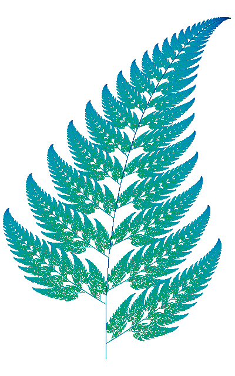
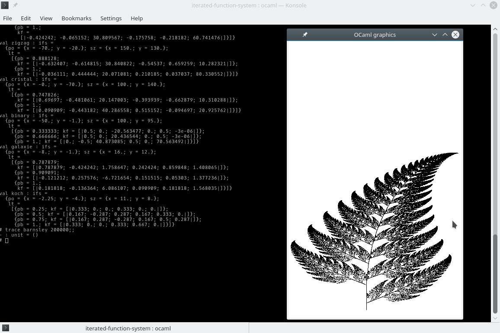
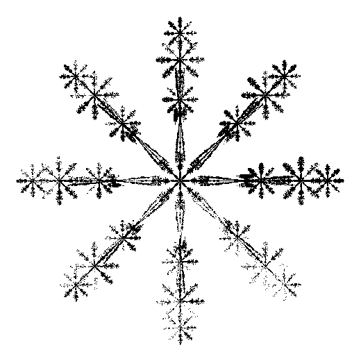
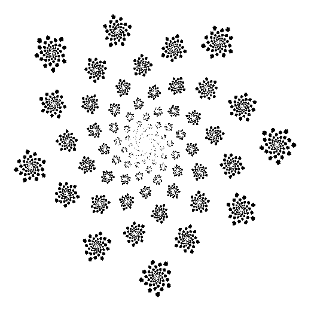
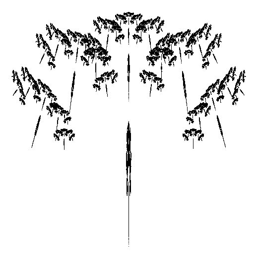

# Iterated Function Systems with OCaml

[](https://opam.ocaml.org/packages/ifs-fractals/)
[](https://doi.org/10.5281/zenodo.21804778)

Fractals are images of infinite complexity, characterized by being "similar" to
themselves in some sense at all scales of magnification.

Iterated function systems (IFS) are a method of generating fractals using
self-similarity. An IFS image is defined as being the sum of geometric
transforms of itself: each transform is a small affine map (a combination of
scaling, rotation and translation) that maps the whole image onto one of its
parts. It turns out that simply specifying the transforms along
with a weight for each transform is enough to determine the image.



This project draws them, as an OCaml library and a command-line tool
packaged together for opam under the name `ifs-fractals`. It offers:

* **Sixteen predefined fractals** — the Barnsley fern, the Sierpiński
  triangle, a dragon curve, a maple leaf, a sunflower, Queen Anne's lace
  and others, listed below.
* **Two ways to draw them.** In a window of the OCaml `graphics` library,
  or straight into a PNG file, which needs no graphical display at all and
  so runs happily on a headless server. The PNG writer is part of the
  library: no image dependency.
* **Density coloring.** Instead of plotting every point in black, each
  pixel can be shaded by how often the chaos game visited it, which brings
  out the structure a flat rendering hides — stems, midribs and spiral
  tips stand out darkest.
* **Fractint `.ifs` files.** Beyond the built-in collection, the tool reads
  the file format of [Fractint](https://fractint.org), the venerable DOS
  fractal generator. That format became a de-facto way of exchanging
  iterated function systems, so the collections published over the decades
  can be drawn as they are, with `ifs-fractals -f somefile.ifs`. Since the
  format records neither which part of the plane to look at nor how to
  weight the maps when the weights are missing, both are worked out from
  the attractor itself when the file is loaded. Its three-dimensional
  systems are drawn too, projected from whatever direction you care to
  look from.
* **Your own fractals**, in a handful of numbers: a few affine maps with
  their weights, and a viewport.


## How it works

The program draws the image with the so-called *chaos game*:

1. Start from an arbitrary point.
2. Pick one of the transforms at random, according to its weight.
3. Apply it to the current point and plot the result.
4. Repeat from step 2, a few hundred thousand times.

Whatever the starting point, the plotted points quickly converge onto the
*attractor* of the system — the fractal image. More iterations simply fill in
the picture with more detail.

In the code, a fractal is described by an `ifs` record. The records live in
`lib/fractals.ml`, apart from the algorithms that draw them in
`lib/ifs_fractals.ml`:

* `lt` — the list of affine transforms. Each transform has a coefficient array
  `kf = [|a; b; c; d; e; f|]` meaning `x' = a*x + b*y + c` and
  `y' = d*x + e*y + f`, and a probability `pb`. The probabilities are
  *cumulative*: the last transform of the list must have `pb = 1.0`.
* `po` and `sz` — the origin and size of the region of the plane to display,
  used to scale the points to the graphics window.

### Available fractals

Sixteen fractals are predefined:

* `barnsley` — the Barnsley fern, the most famous IFS fractal (pictured below);
* `sierpinski` — the Sierpiński triangle;
* `dragon` — a dragon curve;
* `coral` — a coral-like branching shape;
* `tree` — a fractal tree;
* `star` — a star-shaped spiral;
* `zigzag` — a zigzag pattern;
* `crystal` — a crystal-like shape;
* `binary` — a binary branching pattern;
* `galaxy` — a spiral galaxy;
* `koch` — the Koch curve;
* `maple` — a maple leaf;
* `fiddlehead` — the coiled tip of a young fern frond, a spiral made of
  spirals;
* `vegvisir` — an eight-armed rune star inspired by the Icelandic vegvísir
  stave (see "A challenge: the vegvísir" below);
* `sunflower` — a flower head built on phyllotaxis: buds placed by the golden
  angle, each bud a miniature rosette of rosettes;
* `lace` — Queen Anne's lace (wild carrot): an umbel of umbels, where every
  flower cluster on the dome is a whole miniature of the plant (both are
  detailed in "Fractals from nature" below).


## How to use this code

The fractals are drawn in a 400x640 window of the OCaml
[graphics](https://github.com/ocaml/graphics) library, which requires a
graphical display — or rendered straight to a PNG file with the `-o`
option (or the `save_png` function), which requires no display at all.

### Installation with opam

The project is packaged as `ifs-fractals` for
[opam](https://opam.ocaml.org), the OCaml package manager:

```bash
$ opam install ifs-fractals
```

This installs the `ifs-fractals` command:

```bash
$ ifs-fractals barnsley           # draw a fractal in a window
$ ifs-fractals --list             # list the sixteen available fractals
$ ifs-fractals -n 1000000 lace    # override the number of plotted points
$ ifs-fractals -o fern.png barnsley            # render to a PNG file instead
$ ifs-fractals -o big.png -s 800x1280 maple    # ... at a custom size
$ ifs-fractals -o fern.png -c barnsley         # ... colored by point density
```

Rendering with `-o` does not open a window and works without a display,
so it can run on a headless server. The PNG writer is built into the
library — no image library is needed.

With `-c`, instead of plotting every point black, each pixel is colored by
how often the chaos game visited it, on a log scale from light green
(rarely) to dark blue (constantly). This reveals a structure that the flat
rendering hides: the attractor is not uniformly dense, and the regions the
transforms visit most — stems, midribs, spiral tips — stand out darkest.
Density rendering benefits from more points than the defaults.

### In your OCaml interpreter

The package also provides a library, so you can play from the interactive
toplevel:

```ocaml
$ ocaml
# #use "topfind";;
# #require "ifs-fractals";;
# open Ifs_fractals;;
# draw barnsley 200000;;
```

`draw` takes a fractal and the number of points to plot — try smaller values
like `20000` to watch the image build up, or replace `barnsley` with any of
the predefined fractals above.

`draw` returns as soon as the picture is complete, leaving the window on
screen. Note that its close button will not work then: the graphics library
only handles events while the program is inside an event call, and at the
toplevel prompt nothing is reading them. Close the window with
`Graphics.close_graph ();;`, or use `show`, which draws, waits for a
keypress — the close button works during that wait — and then closes:

```ocaml
# show barnsley 200000;;
```

To write a PNG file instead of drawing in a window, use `save_png` (with
optional `~width` and `~height`, defaulting to the window's 400x640):

```ocaml
# save_png barnsley 200000 "fern.png";;
# save_png ~width:800 ~height:1280 maple 200000 "maple.png";;
# save_png ~color:true barnsley 1000000 "fern-density.png";;
```

The result:



### From a clone of the repository

The historical workflow (this project started in 2010 as a single toplevel
script) still works without installing the package. Install the
dependencies once — on Debian/Ubuntu:

```bash
$ sudo apt install ocaml opam
$ opam init
$ opam install graphics ocamlfind
$ eval $(opam env)
```

then, from the repository root:

```ocaml
$ ocaml
# #use "ifs_fractals.ml";;
# draw barnsley 200000;;
```

You can also build and run the executable with dune:

```bash
$ dune exec -- ifs-fractals lace
```

### Defining your own fractal

Add a new `ifs` record in `lib/fractals.ml` — which holds nothing but the
fractals themselves — following the same pattern as the predefined ones:
choose your affine transforms, give them cumulative probabilities ending at
`1.0`, and pick `po`/`sz` so that the attractor fits in the displayed region.
Transform coefficients for many classic fractals can be found in the resources
below.

### Fractint .ifs files

Fractals can also be read from a file in the `.ifs` format of
[Fractint](https://fractint.org), the venerable DOS fractal generator —
a de-facto standard, so the many collections of `.ifs` files published
over the years can be drawn directly:

```bash
$ ifs-fractals -f example/classics.ifs --list    # what the file contains
$ ifs-fractals -f example/classics.ifs fern      # draw one of them
$ ifs-fractals -f my.ifs -o out.png -c fern      # ... or render it to a PNG
```

The name can be omitted when the file holds a single fractal. The format
is plain text: a name, then one affine map per line between braces, then
a closing brace. Anything after a `;` is a comment.

```
fern {                          ; Barnsley's Black Spleenwort
  0    0    0    .16 0 0    .01
  .85  .04 -.04  .85 0 1.6  .85
  .2  -.26  .23  .22 0 1.6  .07
 -.15  .28  .26  .24 0 .44  .07
}
```

Each line is `a b c d e f` — meaning `x' = a*x + b*y + e` and
`y' = c*x + d*y + f`, so the coefficients come in a different order than
in an `ifs` record — followed by an optional probability. Two things the
format leaves out are filled in when loading:

* **Probabilities.** They are plain weights here, not cumulative, and they
  may be missing entirely; in that case each map is weighted by the area
  it covers (the absolute value of its determinant), which is what makes
  the chaos game fill the attractor evenly.
* **The viewport.** A `.ifs` file says nothing about which part of the
  plane to look at, so the chaos game is run briefly to find where the
  attractor actually lives, and the viewport is fitted around it.

From the library, `load_fractint` returns every system in a file, ready to
draw:

```ocaml
# List.iter (fun (name, fs) -> print_endline name) (load_fractint "classics.ifs");;
# let (_, fern) = List.hd (load_fractint "classics.ifs") in draw fern 200000;;
```

#### Systems in space

Fractint files may also hold three-dimensional systems, marked `(3D)` after
the name and written with twelve numbers per line — a 3x3 matrix, then a
translation — plus the usual optional probability:

```
3dfern (3D) {
   .00  .00 0 .0 .18 .0 0  0.0 0.00 0 0.0 0 .01
   .85  .00 0 .0 .85 .1 0 -0.1 0.85 0 1.6 0 .85
   .20 -.20 0 .2 .20 .0 0  0.0 0.30 0 0.8 0 .07
  -.20  .20 0 .2 .20 .0 0  0.0 0.30 0 0.8 0 .07
}
```

These are drawn too. The chaos game is played in space and the points it
visits are flattened onto the picture as they are produced — the maps
themselves cannot be flattened, since each mixes all three coordinates, so
dropping the depth from them would describe a different system entirely.

Which means there is a direction to choose. `-v YAW,PITCH` turns the
attractor before flattening it, in degrees, and the viewport is refitted
for whatever view you ask for:

```bash
$ ifs-fractals -f example/classics.ifs 3dfern            # seen head-on
$ ifs-fractals -f example/classics.ifs -v 57,20 3dfern   # turned and tipped
```

Head-on, the 3D fern looks flat and symmetric; turned, it arches away from
you and reveals that its fronds were never in one plane.

### A challenge: the vegvísir

The `vegvisir` fractal was born from a challenge: could an IFS draw something
like the vegvísir, the Icelandic "wayfinder" stave (famously tattooed on
Björk's arm)?

Strictly speaking, no. An IFS attractor is a single self-similar set — the
image is a union of shrunken copies of *itself* — while the real vegvísir has
a *different* rune at the end of each of its eight arms. That asymmetry is
simply out of reach for an IFS.

What is reachable is a symmetric idealization, built with two tricks:

* **A symmetry map.** The first transform is a pure 45° rotation with scale
  1.0. It is not a contraction and draws nothing by itself: it only teleports
  points between the eight arms, so whatever the other transforms create gets
  replicated all around the circle. It carries most of the probability
  (0.58), tuned so that all eight arms come out equally dense.
* **Arm-motif maps.** The remaining transforms draw a single arm: one
  squashes the whole image into a thin shaft, two plant crossbars at
  different radii (each crossbar being itself a squashed, 90°-rotated copy of
  the entire symbol, which decorates it with rune-like detail for free), one
  places a miniature of the whole symbol at the arm's tip, and a last one
  fills the center.

The result is not a vegvísir — more an eight-armed rune compass whose every
arm ends in an infinitely recursive copy of the whole — but the family
resemblance is there:



Because the symmetry map eats more than half of the random picks without
plotting anything new, this fractal needs more iterations than the others to
fill in — `draw vegvisir 500000;;` is a good start.

### Fractals from nature

The vegvísir experiment taught a lesson: designed symbols resist IFS, while
things that *grow* embrace it. This is no accident. A plant does not follow a
blueprint of its final shape; it grows by repeating simple local rules —
sprout, shrink, turn, repeat. Its final form is the accumulation of the same
rule applied at every scale, which is exactly what an IFS attractor is: the
fern is not *like* a fractal, it is the fixed point of a handful of affine
maps, and so, in a very real sense, are the plants themselves. That is why
the most convincing images in this collection — the fern, the maple leaf, the
tree — take so few numbers to describe, and why Barnsley needed only four
transforms and twenty-four coefficients to capture a fern.

Two more fractals push this idea further.

`sunflower` is phyllotaxis distilled to two transforms. The first rotates
by the golden angle — 137.508°, the angle real plants use to place successive
seeds and florets — while contracting slightly toward the center. Because the
golden angle is the "most irrational" angle, consecutive buds never line up
into spokes; they fill the disk evenly, exactly as in a real sunflower head
or a romanesco. The second transform plants a bud at the rim, and since every
bud is a copy of the whole attractor, each one is a rosette made of rosettes:



`lace` is Queen Anne's lace (wild carrot), whose flower is an *umbel*: a dome
of stalks radiating from one point, each stalk ending in a smaller umbel,
each of those in smaller umbels still — an umbrella made of umbrellas. Five
transforms place shrunken, slightly rotated copies of the entire plant along
the rim of the dome, and a sixth squashes the whole image into the thin stem:



Draw them with `draw sunflower 500000;;` and `draw lace 300000;;`.


## Paper

The design techniques behind the fractals added in 2026 (stem maps, spiral
generators, radial replication, golden-angle maps and non-contracting
symmetry maps) are written up in a short paper,
[*Building New IFS Attractors: a Working Vocabulary of Affine Maps*](paper/),
also archived at
[doi.org/10.5281/zenodo.21804778](https://doi.org/10.5281/zenodo.21804778).

```bibtex
@misc{https://doi.org/10.5281/zenodo.21804778,
  doi       = {10.5281/ZENODO.21804778},
  url       = {https://zenodo.org/doi/10.5281/zenodo.21804778},
  author    = {Bonhomme, Cédric},
  keywords  = {chaos, chaos-game, IFS, Fractals, Ocaml, Fractals, Iterated Function Systems},
  language  = {en},
  title     = {Building New IFS Attractors: a Working Vocabulary of Affine Maps},
  publisher = {Zenodo},
  year      = {2026},
  copyright = {Creative Commons Attribution Share Alike 4.0 International}
}
```

An earlier report on fractal landscapes (in French), cited in the paper as
the *statistically* self-similar counterpart of the exactly self-similar
constructions used here:

```bibtex
@misc{bonhomme2008paysagesfractals,
  title    = {Les paysages fractals},
  author   = {Bonhomme, Cédric and Bettinger, Jean-Charles},
  year     = {2008},
  doi      = {10.5281/zenodo.21821796},
  url      = {https://doi.org/10.5281/zenodo.21821796},
  note     = {Université Paul-Verlaine de Metz, Metz, France},
  language = {fr}
}
```


## Resources

This work was carried out during a functional programming course.

Some information about Iterated Function Systems (with the Barnsley Fern):

* https://web.archive.org/web/20160913030719/http://nahee.com/spanky/www/fractint/ifs_type.html
* https://web.archive.org/web/20160509162647/http://paulbourke.net/fractals/ifs_fern_a/
* https://web.archive.org/web/20160401092248/http://mathcurve.com/fractals/fougere/fougere.shtml
* https://web.archive.org/web/20160401180724/http://charles.vassallo.pagesperso-orange.fr/fr/art/ifs.html


## Alternatives

* IFS in Common Lisp: https://github.com/jl2/ifs-qt
* J: https://news.ycombinator.com/item?id=12803076
* Barnsley Fern in G'MIC: https://rosettacode.org/wiki/Barnsley_fern#G.27MIC
