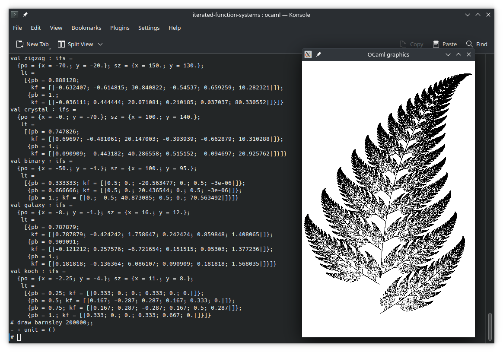

Iterated Function Systems with OCaml
====================================

```bash
$ sudo apt install ocaml opam
$ opam install graphics
$ opam install ocamlfind
$ eval `opam config env`
$ ocaml
        OCaml version 4.11.1

# 
```

In your OCaml interpreter type:

```ocaml
# #use "ifs_fractals.ml";;
# trace barnsley 200000;;
```



This work was carried out during a functional programming course.

Some information about Iterated Function Systems (with the Barnsley Fern):

* https://web.archive.org/web/20160913030719/http://nahee.com/spanky/www/fractint/ifs_type.html
* https://web.archive.org/web/20160509162647/http://paulbourke.net/fractals/ifs_fern_a/
* https://web.archive.org/web/20160401092248/http://mathcurve.com/fractals/fougere/fougere.shtml
* https://web.archive.org/web/20160401180724/http://charles.vassallo.pagesperso-orange.fr/fr/art/ifs.html

Alternatives
------------

* IFS in Common Lisp: https://github.com/jl2/ifs-qt
* J: https://news.ycombinator.com/item?id=12803076
* Barnsley Fern in G'MIC: https://rosettacode.org/wiki/Barnsley_fern#G.27MIC
